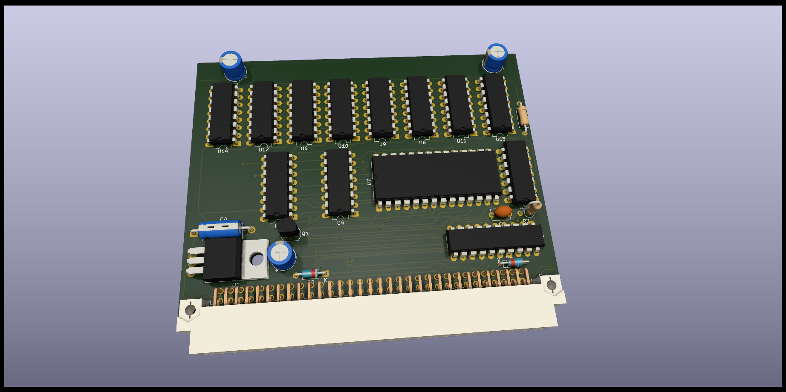
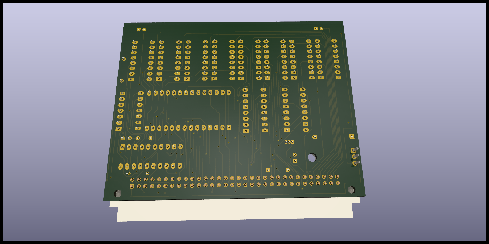
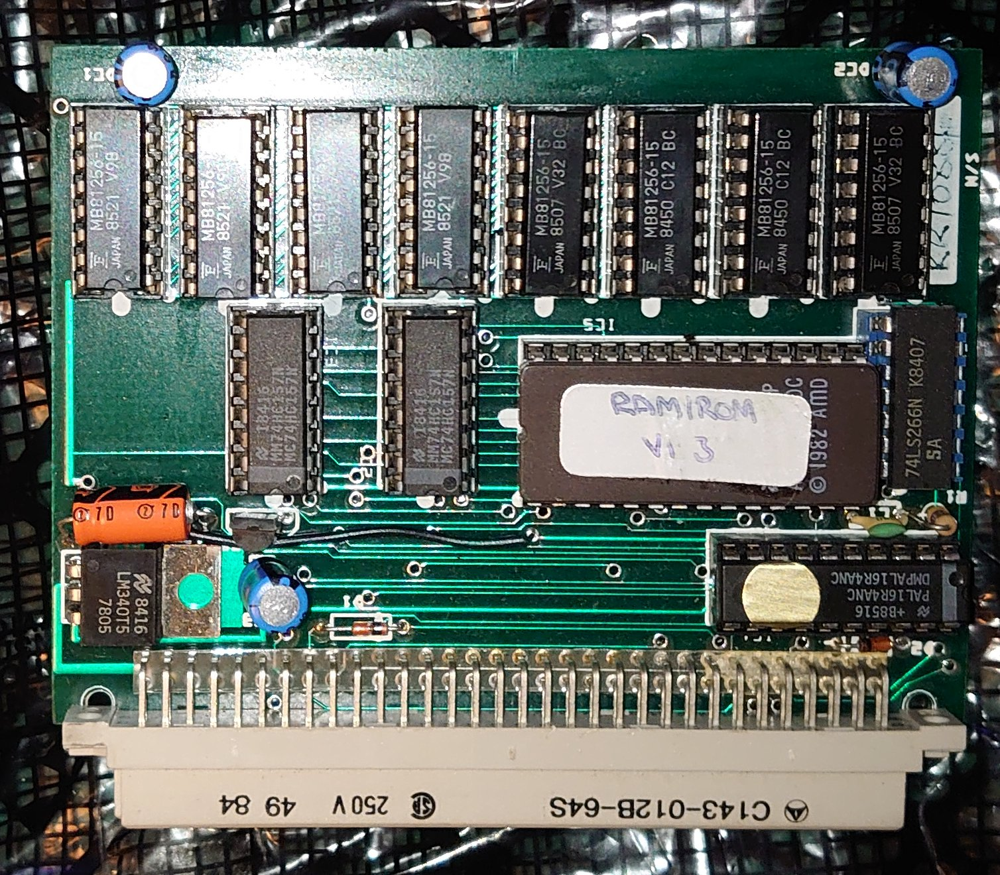
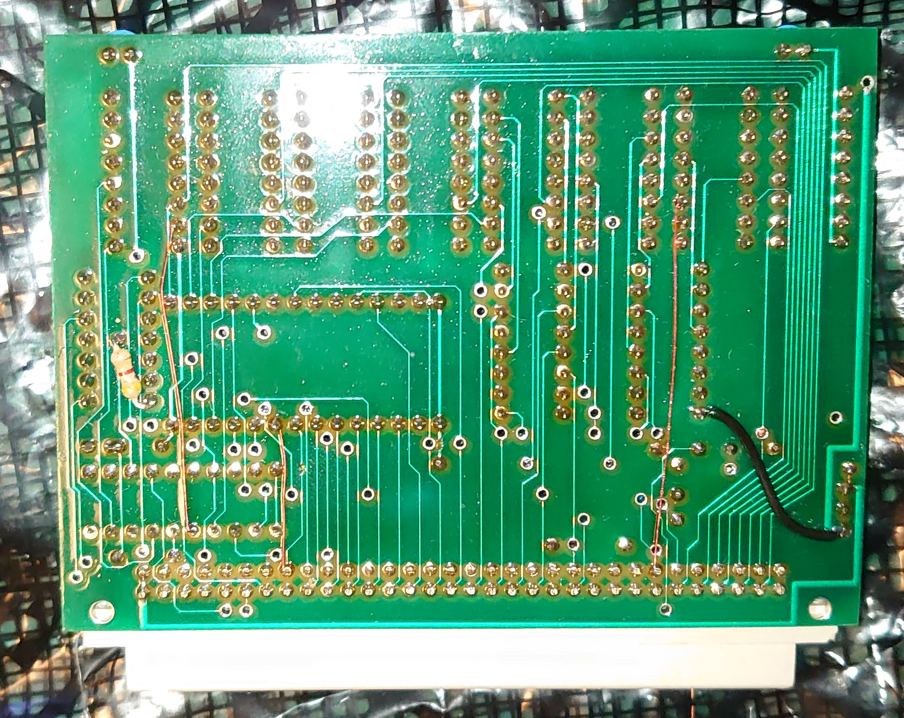

# RAM/ROM Sinclair QL Interface.
A board that provide 256Kb of RAM and a Toolkit in ROM for the Sinclair QL.

# THIS IS WORK IN PROGRESS.ACTUALY THIS INTERFACE DO NOT WORK!!!!! BE AWARE
## NOT FOR USE, THIS IS ONLY A MOCKUP, WORK IN PROGRESS

(C) 2023 Alvaro Alea Fernandez.

This board has been reversed engineered from pictures by vanpeebles in this post: https://qlforum.co.uk/viewtopic.php?t=4353

Some Render of the board:

The original pictures:

